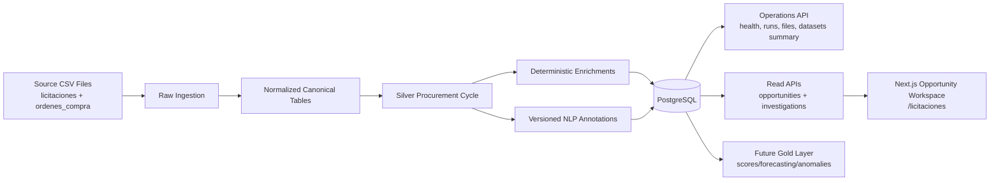
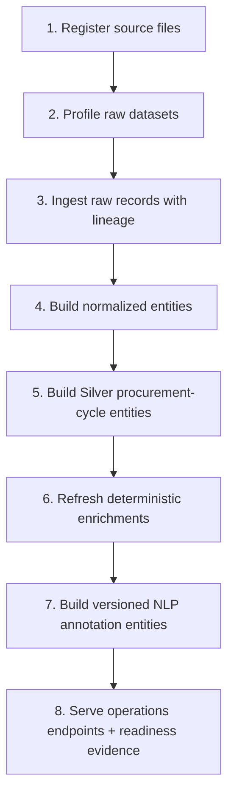

# App ChileCompra - Procurement Data Platform


Deterministic procurement data platform for ChileCompra workflows:
Raw ingestion + canonical normalization + Silver procurement-cycle modeling + deterministic enrichments + versioned NLP annotations + read-only investigation/opportunity APIs + a Next.js Opportunity Workspace.

## Overview

This monorepo implements a stage-gated data platform focused on trustworthy procurement analytics foundations.

Current product direction:

- System of record: ingest source CSV datasets with explicit lineage and fail-fast data contracts
- Canonical layer: normalize source grain into deterministic relational entities
- Silver layer: model full procurement cycle (notice -> line -> bid -> award -> purchase order -> purchase order line)
- Analytics foundation: add deterministic feature engineering and NLP annotations without predictive business scoring in Silver

## Current Platform Status

| Area | Current Status |
|---|---|
| Phase | Silver procurement-cycle foundation implemented; read-only Gold-facing investigation/opportunity workspace in progress |
| Backend | FastAPI + SQLAlchemy + Alembic |
| Frontend | Next.js app in `client/` with `/licitaciones` workspace |
| Database | PostgreSQL |
| Data Layers | Raw + Normalized + Silver canonical entities |
| API Surface | Health, operations, investigation, and opportunity read routes |
| Local CLI | `just` recipes; Docker-first runtime |
| OpenSpec Runtime | Active changes live under `openspec/changes/`; use `/prime` before routing work |
| Version | `0.1.0` |
| Last Verified | 2026-04-29 |

## Main Capabilities

- raw dataset profiling and append-oriented ingestion with source lineage
- normalized deterministic entities (`licitaciones`, items, offers, purchase orders, buyers/suppliers/categories)
- Silver procurement-cycle canonical entities:
  - `silver_notice`
  - `silver_notice_line`
  - `silver_bid_submission`
  - `silver_award_outcome`
  - `silver_purchase_order`
  - `silver_purchase_order_line`
  - master/bridge entities (`silver_buying_org`, `silver_contracting_unit`, `silver_supplier`, `silver_category_ref`, `silver_notice_purchase_order_link`, `silver_supplier_participation`)
- deterministic feature engineering in Silver:
  - temporal durations
  - administrative flags
  - structural counts
  - competition metrics
  - notice -> purchase order materialization metrics
- versioned NLP annotation entities:
  - `silver_notice_text_ann`
  - `silver_notice_line_text_ann`
  - `silver_purchase_order_line_text_ann`
- strict Silver guardrails:
  - forbid predictive business fields (`*_score`, `*_probability`, `future_*`, forecast/recommendation fields)
  - enforce TF-IDF reference-only persistence (`tfidf_artifact_ref`)
- read-only workspace APIs:
  - opportunity list/summary/detail under `/opportunities`
  - procurement line investigations under `/investigations/procurement-lines`
- frontend Opportunity Workspace:
  - Next.js app under `client/`
  - primary route: `/licitaciones`
  - Spanish read-only UI over API-backed opportunity data

## Architecture At a Glance



## Core Workflow



## Repository Layout

```text
.
├── backend/
│   ├── api/                      # FastAPI routers (health, operations, opportunities, investigations)
│   ├── core/                     # config and runtime settings
│   ├── db/                       # DB base/session wiring
│   ├── ingestion/                # ingestion contracts and source registration
│   ├── models/                   # operational/raw/normalized/silver ORM models
│   ├── normalized/               # deterministic transform builders
│   ├── observability/            # structured logging utilities
│   └── main.py
├── client/                       # Next.js Opportunity Workspace frontend
│   ├── app/licitaciones/         # primary workspace route
│   └── src/                      # UI, API clients, feature modules
├── scripts/                      # pipeline/operator entrypoints
│   ├── profile_raw.py
│   ├── ingest_raw.py
│   └── build_normalized.py
├── alembic/                      # migration source of truth
├── data/                         # local artifacts/state
├── docs/                         # architecture, runbooks, standards, evidence
├── openspec/                     # change proposals/spec workflow
├── .codex/commands/              # repo-local Codex command workflows
├── justfile                      # unified local CLI
└── README.md
```

## Agent Path Guide

Use this routing before making changes:

- Backend/API: `backend/api/routers/`, `backend/core/`, `backend/db/`, `backend/models/`
- Data transforms/pipeline: `backend/ingestion/`, `backend/normalized/`, `scripts/`
- Migrations/schema: `alembic/versions/` plus `backend/models/`; Alembic is source of truth
- Frontend workspace: `client/app/licitaciones/`, `client/src/features/opportunity-workspace/`, `client/src/lib/api/`
- Runtime docs: `docs/runbooks/docker-local.md` first, then `docs/runbooks/local_development.md`
- Architecture/data docs: `docs/architecture/`
- Change planning: `openspec/changes/<change>/`; run `/prime` before choosing `/plan`, `/execute`, `/validate`, or archive work

This repo is Docker-first. Agents should plan to execute backend, database, migration, pipeline, and quality checks through the container runtime before considering host-local commands. Prefer `rtk just docker-start`, `rtk just docker-pipeline-full`, and `rtk just docker-smoke` when `rtk` is available. Host `uv` / `.venv` workflows are fallback paths only when the container route is unavailable, blocked, or the task is frontend-only.

## Getting Started

### Docker Desktop (Canonical Path)

Use this path for reproducible local runtime:

```bash
just docker-start
```

Open:

- API docs: `http://localhost:8000/docs`

Docker runbook: [`docs/runbooks/docker-local.md`](docs/runbooks/docker-local.md)

### Prerequisites

- Docker Desktop
- `just`
- `rtk` for agent-issued local workflow commands when available
- Node.js/npm only when running the frontend in `client/`

### Configure Environment

Minimum expected variables in `.env`:

```bash
APP_ENV=local
APP_NAME=app-chilecompra
APP_PORT=8000
DATABASE_URL=postgresql+psycopg://postgres:postgres@db:5432/chilecompra
TEST_DATABASE_URL=postgresql+psycopg://postgres:postgres@db_test:5432/chilecompra_test
LOG_LEVEL=INFO
DATASET_ROOT=/absolute/path/to/dataset-mercado-publico
```

For Docker, edit `.env.docker` and mount the host dataset read-only through `DATASET_HOST_PATH`. Container-internal PostgreSQL hosts must be service DNS names (`db`, `db_test`), not `localhost`.

### Run Pipelines and Backend

```bash
just docker-pipeline-full
```

- API base: `http://localhost:8000`
- API docs: `http://localhost:8000/docs`
- OpenAPI: `http://localhost:8000/openapi.json`

### Run Frontend

```bash
cd client
npm install
npm run dev -- --hostname 127.0.0.1 --port 3000
```

Open:

- Workspace: `http://127.0.0.1:3000/licitaciones`

Keep backend running with `just docker-start` and set `NEXT_PUBLIC_API_BASE_URL=http://localhost:8000` in `client/.env.local`.

## Local Quality Gates

Use the container-first path before host-local validation. For agents, the first plan should be Docker/Compose-backed `just` recipes; direct `uv run`, `.venv`, or local Python commands are fallbacks that should be explained when used.

```bash
just quality
just ci-fast
just ci
```

Targeted workflows:

- unit tests: `just test-unit`
- integration tests: `just test-integration`
- lint/type/security: `just lint`, `just type`, `just security`
- strict typing: `just type-strict`

## Unified CLI (`just`) Overview

- Setup: `just uv-sync` (containerized; no host `uv` required)
- Docker runtime: `docker-start`, `docker-build`, `docker-bootstrap`, `docker-pipeline-full`, `docker-smoke`
- Quality and CI: `quality`, `ci-fast`, `ci`, plus lint/type/test/security recipes

## API Surface (Current)

- Health:
  - `GET /health`
- Operations:
  - `GET /runs`
  - `GET /runs/{run_id}`
  - `GET /files`
  - `GET /files/{source_file_id}`
  - `GET /datasets/summary`
- Opportunities:
  - `GET /opportunities`
  - `GET /opportunities/summary`
  - `GET /opportunities/{notice_id}`
- Investigations:
  - `GET /investigations/procurement-lines`
  - `GET /investigations/procurement-lines/{notice_id}/{item_code}`

## Documentation Index

- docs home: [`docs/README.md`](docs/README.md)
- architecture: [`docs/architecture/`](docs/architecture)
- runbooks: [`docs/runbooks/`](docs/runbooks)
- product context: [`docs/product/`](docs/product)
- standards: [`docs/standards/`](docs/standards)
- references: [`docs/references/`](docs/references)
- evidence: [`docs/evidence/`](docs/evidence)

## Delivery Rules

- fail-fast on broken contracts, schema drift, or required dependency misconfiguration
- TDD-first for behavior changes
- SDD-first for framework/library usage (documented in `docs/references/`)
- no Gold/predictive business scoring inside Silver until stage-gate criteria are met
